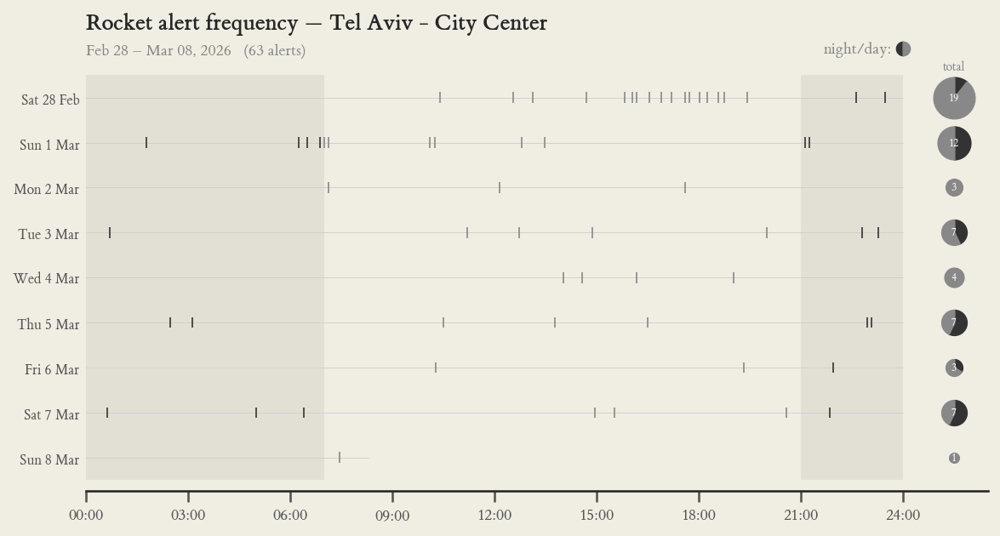

# Israel Alarms Timeline by Locality

Generates timeline charts of rocket/missile alerts for any locality in Israel.
Each row is a day; dots (or ticks) show when alerts fired, sized by count.



## Usage

Requires [uv](https://docs.astral.sh/uv/). No manual install needed — dependencies are declared inline.

```bash
# Default: Tel Aviv city center, last week
uv run alarms_graph.py

# Specific area and date range
uv run alarms_graph.py --area "אשקלון" --label "Ashkelon" --start 2025-01-01

# All areas, 3-hour bins
uv run alarms_graph.py --area "" --label "All Areas" --bin-hours 3

# Tick-per-alert style instead of binned dots
uv run alarms_graph.py --style lines
```

### Options

| Flag | Description | Default |
|------|-------------|---------|
| `--area` | Hebrew substring to filter localities | `תל אביב - מרכז העיר` |
| `--label` | English name for the chart title | `Tel Aviv - City Center` |
| `--start` | Start date (`YYYY-MM-DD`) | `2026-02-28` |
| `--bin-hours` | Bin size in hours | `1` |
| `--threat` | `0`=missiles, `5`=UAV, `-1`=all | `0` |
| `--style` | `dots` (binned) or `lines` (exact time) | `dots` |
| `--output` | Output image path | `alarms_frequency.png` |

## Data sources

- [yuval-harpaz/alarms](https://github.com/yuval-harpaz/alarms) — historical CSV (~122K rows, 2019–present)
- [tzevaadom API](https://api.tzevaadom.co.il) — real-time last-hour alerts

Both are cached locally and refreshed automatically.

## License

MIT
